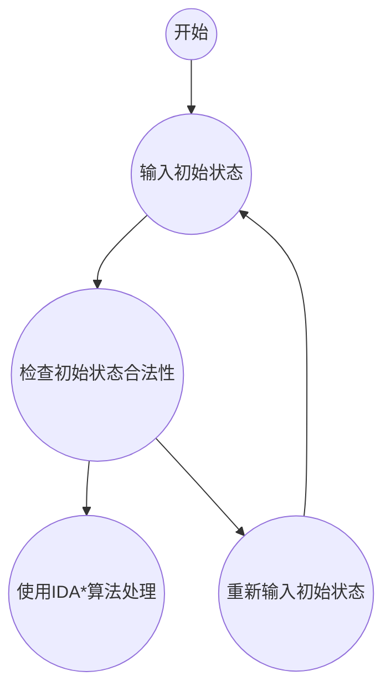

# 人工智能大作业：基于迭代加深的A*算法求解八数码问题

- 基于迭代加深
- 矩阵压缩存储
- 评估函数：当前深度 + 到达目标状态所需的最小次数
- 剪枝
  - 最优性剪枝：评估函数剪枝
  - 记忆化剪枝：康托展开优化的哈希映射
- 具有简单交互
- 用cmake构建项目


## 环境

```shell
OS: Ubuntu 22.04.2 LTS on Windows 10 x86_64 
Kernel: 5.10.16.3-microsoft-standard-WSL2 
Uptime: 2 hours, 12 mins 
Packages: 586 (dpkg) 
Shell: zsh 5.8.1 
Terminal: vscode 
CPU: AMD Ryzen 5 5500U with Radeon Graphics (12) @ 2.095GHz 
GPU: 2e97:00:00.0 Microsoft Corporation Device 008e 
Memory: 961MiB / 11045MiB 
```

```shell
vscode-server 1.88.1 e170252f762678dec6ca2cc69aba1570769a5d39 x64
git version 2.34.1
g++ (Ubuntu 11.4.0-1ubuntu1~22.04) 11.4.0
Ubuntu clangd version 14.0.0-1ubuntu1.1
cmake version 3.22.1
```

## 介绍

八数码问题是一个经典的拼图游戏，通过移动数字方块来重新排列它们，使得它们按照从小到大的顺序排列，并且留出一个空格作为移动的空间。在本次作业中，目标状态为：

| 1    | 2    | 3    |
| ---- | ---- | ---- |
| 4    | 5    | 6    |
| 7    | 8    | 0    |

`A*`算法是一种用于路径搜索的启发式算法。它评估每个可能路径的代价，找到起点到终点的最佳路径。算法包括定义启发式评估函数、维护开放和关闭列表、评估节点、选择最佳节点、更新路径和重复步骤直到找到最佳路径或无法到达终点。

迭代加深搜索则是一种深度优先搜索算法的改进版，通过逐步增加搜索深度的方式提高搜索效率。算法从较浅的深度开始搜索，逐步增加深度，直到找到目标状态或达到设定的最大深度为止。这种方法在保持简单性和低内存消耗的同时，能够更有效地探索搜索空间，特别适用于搜索树较大但最优解不太深的问题。

迭代加深的`A*`算法结合了`A*`搜索和迭代加深搜索的特点，旨在解决搜索空间庞大的问题，同时保证找到最优解。其基本思想是在迭代加深的框架下，利用`A*`算法的启发式搜索策略来引导搜索。

## 矩阵压缩存储

将二维矩阵压缩为一维数组。令数组下标$i$从0开始，那么对于行row，列col来说，有以下映射关系：
$$
row = \frac {i} {3} \\
col = i \mod 3
$$


## 评估函数

评估函数是当前深度加到达目标状态所需的最小次数，到达目标状态所需的最小次数可以用曼哈顿距离进行表示。曼哈顿距离指两点所在的横坐标的绝对值加上坚坐标的绝对值，其值越大，表示两点间隔的较远。

评估函数代码实现为：

```cpp
int mhd_single(int target_pos, int current_pos) {
        return std::abs((target_pos ) / 3 - (current_pos - 1) / 3) + std::abs((target_pos ) % 3 - (current_pos - 1) % 3);

}

int mhd(std::vector<int> vec) {
    int len = vec.size();
    int sum = 0;
    for(int i = 0; i < len; ++i) {
        if(vec[i] == 0) continue;
        sum += mhd_single(i, vec[i]);
    }
    return sum;
}
```

## 剪枝

### 最优性剪枝：评估函数剪枝

对于当前迭代加深的深度$max\_depth$来说，如果当前深度加上曼哈顿距离已经大于$max\_depth$，那么到达目标状态的迭代深度不可能小于$max\_depth$，因此直接返回即可。

```cpp
    if(cur_depth + mhd > max_depth) return false;
```

### 记忆化剪枝：康托展开优化的哈希映射

对于不同的中间状态而言，如果当前状态在前面的状态中存在，那么就不用再用当前状态进行搜索了，因为当前状态到达目标状态所用的迭代深度一定不如之前已经存在的相同状态到目标状态所用的迭代深度。

因此，我们可以用哈希映射记录中间状态。但是数组的哈希映射所用空间较大，发现对于八数码而言只有0到8这九个数字，可以用字符串进行映射。本次作业用康托展开进行哈希映射。

康托展开可以用来求一个$1 - n$的任意的排名。康托展开是一个全排列到一个自然数的双射，常用于构建特定哈希表时的空间压缩。

表达式为：
$$
Cantor = a_n(n - 1)! + a_{n-1}(n-2)! + ... + a_1 \times 0!
$$
​    其中，$Cantor$为比当前排列小的全排列个数（$Cantor$即为当前排列的次序编号）；$n$表示全排列表达式的字符串长度; 表示原排列表达式中的第 $i$位（由右到左由低到高）在当前未出现（剩下未被选择）的元素集合中比其小的元素个数。

康托展开代码：

```cpp
namespace Cantor {

LL fact[MaxSize] = {1,1,2,6,24,120,720,5040,40320,362880}; // 定义0~9的阶乘表

LL get_fact(int idx, int count) {
    if(n - idx - 1 < 0) {
        std::cerr<<"ERROR!!!"<<std::endl;
        exit(0);
    }
    return fact[n - idx - 1] * count;
}

LL cantor_value(std::vector<int> vec) {
    LL sum = 0; //记录总的在s之前数目
    int len = vec.size();
    for(int i = 0; i < len; ++i) {
        int cnt = 0;
        for(int j = i + 1; j < len; ++j) {
            if(vec[j] < vec[i]) ++cnt;
        }
        sum += get_fact(i, cnt);
    }
    return sum + 1;
}
}
```

## 迭代加深A*算法代码实现

见注释：

```cpp
bool dfs(int zero_pos, int cur_depth) {
    // 得到当前状态的评估函数
    int mhd = EvaluationFunctions::mhd(arr);
    if(mhd == 0) {
        // 找到目标
        return true;
    }
    // 如果当前深度加上曼哈顿距离已经大于max_depth，直接返回。
    if(cur_depth + mhd > max_depth) return false;

    // 得到0在矩阵中的坐标 （行row，列col）
    int row = zero_pos / 3, col = zero_pos % 3;

    // 上下左右四个方向进行搜索
    for(int i = 0; i < 4; ++i) {
        int x = row + Direction::d4::get_x(i);
        int y = col + Direction::d4::get_y(i);

        // 得到下一个状态0的一维值
        int new_pos = x * 3 + y; // 移动后的新位置

        // 判断在二维是否越界
        if(x < 0 || x > 2 || y < 0 || y > 2) continue;
        // 没有越界，棋盘进行移动
        std::swap(arr[zero_pos], arr[new_pos]);
        
        // 得到康托展开的全排列序号
        LL cantor = Cantor::cantor_value(arr);
        // 如果在哈希表中找到，表示当前状态已存在于中间状态
        if(vis.find(cantor) != vis.end()) {
            // 状态已存在映射关系
            std::swap(arr[zero_pos], arr[new_pos]);
            continue;
        } 
        // 记录状态的映射
        vis[cantor] = true;
        if(dfs(new_pos, cur_depth + 1)) return 1;
        // 回溯：坐标回溯 + 状态剔除
        std::swap(arr[zero_pos], arr[new_pos]);
        vis.erase(cantor);

    }
    return false;
}

void IDDFS(int zero_pos, std::vector<int> init_stat) {
    arr = init_stat;
    int mhd = EvaluationFunctions::mhd(arr);
    if(mhd == 0) { // 对0特判
        std::cout<<0<<std::endl;
        return ;
    }
    std::cout<<mhd<<std::endl;
    max_depth = 0;
    // 无解情况考虑： 8！ https://www.luogu.com.cn/problem/solution/P1379
    // 状态只有 8!，8! = 40320，因此当 max_depth 大于40320时无解，退出迭代加深
    while(++max_depth <= 50000) {
        vis = std::map<LL,bool>();
        arr = init_stat;
        if(dfs(zero_pos, 0)) break;
    } 
    if(max_depth >= 50000) {
        std::cout<<"无解"<<std::endl;
    }
    std::cout<<max_depth<<std::endl;
    std::cout<<"结束"<<std::endl;
}
```


## 简单交互

为了处理不同初始状态的读入。简单交互流程如下：




代码：

```cpp
namespace EightPuzzleInput {

// 初始读入八数码
std::vector<int> init_stat;

// 开始
void start() {
    while(true) {
        std::cout<<"退出还是开始八数码，退出输入q"<<std::endl;
        std::string op; getline(std::cin, op);
        if(op.find("q") != std::string::npos) {
            break;
        } else {
            display_menu();
            getchar();
            // system("clear");
        }
    }
    std::cout<<"程序结束"<<std::endl;
}

bool check_init_stat(std::vector<int> vec) {
    std::vector<int> vis(10);
    for(auto &t: vec) {
        vis[t]++;
    }
    for(int i = 0; i < 9; ++i) {
        if(vis[i] == 1) continue;
        return false;
    }
    return true;
}

void printBoard(std::vector<int> vec) {
    int cnt = 0;
    for(int i = 0; i < 9; ++i) {
        std::cout<<vec[i]<<" ";
        cnt++;
        if(cnt == 3) {
            cnt = 0;
            std::cout<<std::endl;
        }
    }
}

void input_init_stat() {
    init_stat.clear();
    std::cout<<"请输入初始八数码"<<std::endl;
    int x;
    while(init_stat.size() < 9) {
        std::cin>>x;
        if(x < 0 || x >= 9) {
            std::cout<<"输入值 [ "<<x<<" ] 不合法，重新输 or 直接结束 (n/q)"<<std::endl;
            std::string op; getline(std::cin, op);
            if(op.find("n") != std::string::npos) {
                continue;
            } else {
                return ;
            }
        }
        init_stat.push_back(x);
    }
    if( !check_init_stat(init_stat)) {
        std::cout<<"初始状态不合法："<<std::endl;
        printBoard(init_stat);
        return ;
    }
    std::cout<<"初始状态为："<<std::endl;
    printBoard(init_stat);
    std::cout<<std::endl;
}

// 主界面
void display_menu() {
    input_init_stat();
    // input_target_stat();
}

}
```

## 用cmake构建项目

项目文件树：

```shell
.
├── CMakeLists.txt
├── README.md
├── auto_build.sh
├── build
│   ├── *
├── include
│   ├── A_star.h
│   ├── cantor_expansion.h
│   ├── input_processor.h
│   └── test_cases.h
├── main.cpp
└── src
    ├── A_star.cpp
    ├── cantor_expansion.cpp
    ├── input_processor.cpp
    └── test_cases.cpp
```

CMakeLists.txt文件内容：

```cmake
cmake_minimum_required(VERSION 3.0.0)
project(EightPuzzle-AStar-IDDFS VERSION 0.1.0 LANGUAGES C CXX)

include(CTest)
enable_testing()
include_directories(include)

add_executable(EightPuzzle-AStar-IDDFS main.cpp src/A_star.cpp src/cantor_expansion.cpp src/input_processor.cpp src/test_cases.cpp)

set(CPACK_PROJECT_NAME ${PROJECT_NAME})
set(CPACK_PROJECT_VERSION ${PROJECT_VERSION})
include(CPack)
```


## 参考

[C++ 八数码问题理解 `IDA*` 算法原则：及时止损，缘尽即散-CSDN博客](https://blog.csdn.net/y6123236/article/details/136210573)

[Eight - HDU 1043 - Virtual Judge (vjudge.net)](https://vjudge.net/problem/HDU-1043)

[康托展开 - OI Wiki (oi-wiki.org)](https://oi-wiki.org/math/combinatorics/cantor/)

[【数论系列】 康托展开-CSDN博客](https://blog.csdn.net/qq_40772692/article/details/80549303?ops_request_misc=&request_id=&biz_id=102&utm_term=康托展开&utm_medium=distribute.pc_search_result.none-task-blog-2~all~sobaiduweb~default-0-80549303.nonecase&spm=1018.2226.3001.4187)

[P1379 八数码难题 - 洛谷 | 计算机科学教育新生态 (luogu.com.cn)](https://www.luogu.com.cn/problem/solution/P1379)

[cmake构建和简单实操_cmake构建实战:项目开发卷-CSDN博客](https://blog.csdn.net/qq_63432403/article/details/135717528)